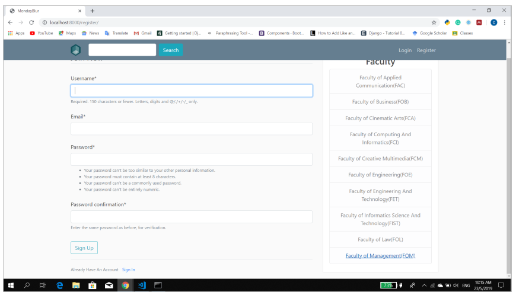
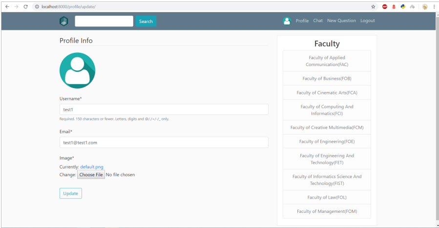
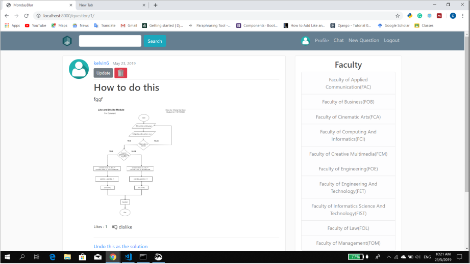

# Mondayblur
A simple django application which provides a platform for students to ask questions.

For more info, can refer the documentation pdf file in the reference folder

# How to start the app?
I have hosted the app on heroku, feel free to click this [link](https://mondayblur.herokuapp.com/) and try to explore.

If you want to start locally, please follow the following steps:
1. Clone this repo
2. Create an virtual env and pip install requirements.txt
3. Navigate into mondayblur folder, run the manage.py file with the command python manage.py runserver

# Sample images of this app

